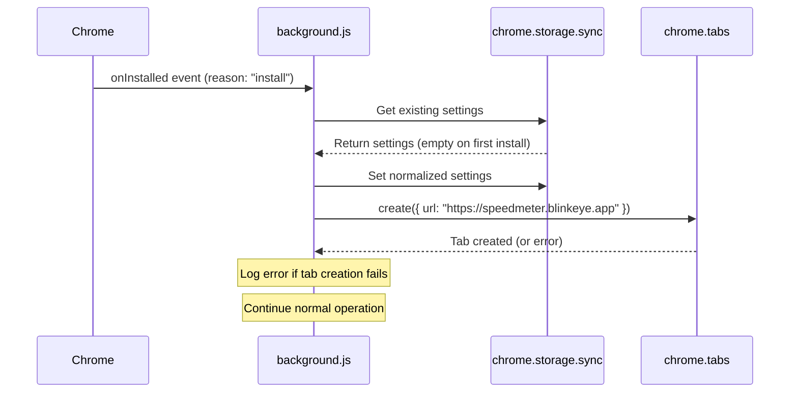

# Design Document: Onboarding Welcome Page

## Overview

This feature adds first-install onboarding by opening the SpeedMeter welcome page (speedmeter.blinkeye.app) when a user installs the extension for the first time. The implementation leverages Chrome's `runtime.onInstalled` event listener to detect installation events and distinguish between first installs and updates.

The design integrates seamlessly with the existing initialization flow in background.js, ensuring that settings initialization completes before opening the welcome page, while maintaining graceful error handling to prevent any failures from disrupting core extension functionality.

## Architecture

The implementation follows a single-responsibility approach by extending the existing `chrome.runtime.onInstalled` listener in background.js. The architecture maintains the current event-driven model where the background service worker responds to Chrome extension lifecycle events.



The design preserves the existing initialization logic and adds the welcome page opening as a final step, ensuring backward compatibility and minimal risk to existing functionality.

## Components and Interfaces

### Modified Component: chrome.runtime.onInstalled Listener

**Location:** background.js

**Current Behavior:**
- Loads existing settings from chrome.storage.sync
- Normalizes settings with defaults
- Saves merged settings back to storage

**New Behavior:**
- Performs all existing initialization steps
- Checks the `reason` property of the event details
- If reason is "install", opens welcome page in new tab
- Handles errors gracefully without disrupting initialization

**Interface:**

```javascript
chrome.runtime.onInstalled.addListener(async (details) => {
  // details.reason: "install" | "update" | "chrome_update" | "shared_module_update"
  // details.previousVersion: string (only present for "update")
});
```

### Chrome APIs Used

**chrome.tabs.create:**
```javascript
chrome.tabs.create(
  {
    url: string,        // The URL to open
    active?: boolean    // Whether tab should be active (optional)
  },
  callback?: (tab: Tab) => void
)
```

**chrome.storage.sync:**
- Already used extensively in the codebase
- No changes to existing usage patterns

## Data Models

### Installation Event Details

```typescript
interface OnInstalledDetails {
  reason: "install" | "update" | "chrome_update" | "shared_module_update";
  previousVersion?: string;  // Only present when reason is "update"
  id?: string;               // Extension ID
}
```

### Welcome Page Configuration

```javascript
const WELCOME_PAGE_URL = "https://speedmeter.blinkeye.app";
```

This constant will be defined at the top of background.js alongside other configuration constants like `DEFAULT_SETTINGS` and `DEBUGGER_VERSION`.

### No State Changes

This feature does not require any new state management:
- No new properties added to the `state` object
- No new storage keys required
- No persistent tracking of whether welcome page was shown (Chrome's event system handles this)


## Correctness Properties

*A property is a characteristic or behavior that should hold true across all valid executions of a system—essentially, a formal statement about what the system should do. Properties serve as the bridge between human-readable specifications and machine-verifiable correctness guarantees.*

Since this feature involves specific event handling and browser API interactions rather than data transformations over arbitrary inputs, the correctness properties are expressed as concrete examples that verify specific scenarios. These examples will be implemented as unit tests.

### Example 1: First install opens welcome page

When the onInstalled event fires with reason "install", the handler should call chrome.tabs.create with the URL "https://speedmeter.blinkeye.app".

**Validates: Requirements 1.1, 1.3**

### Example 2: Updates do not open welcome page

When the onInstalled event fires with reason "update", the handler should NOT call chrome.tabs.create.

**Validates: Requirements 1.2**

### Example 3: Welcome page opens in new tab

When opening the welcome page, the handler should use chrome.tabs.create (which creates a new tab) rather than modifying existing tabs.

**Validates: Requirements 1.4**

### Example 4: Settings initialize before welcome page

When the onInstalled event fires with reason "install", chrome.storage.sync.set should be called before chrome.tabs.create.

**Validates: Requirements 2.1**

### Example 5: Welcome page opens despite settings failure

When chrome.storage.sync operations throw an error during first install, the handler should still attempt to call chrome.tabs.create.

**Validates: Requirements 2.3**

### Example 6: Tab creation errors are logged and handled

When chrome.tabs.create throws an error, the handler should log the error to console.error and complete without throwing.

**Validates: Requirements 3.1, 3.2**

### Example 7: No notifications on welcome page failure

When chrome.tabs.create fails, the handler should NOT call chrome.notifications.create.

**Validates: Requirements 3.3**

## Error Handling

### Tab Creation Failures

The welcome page opening is wrapped in a try-catch block to handle potential failures:

- Network connectivity issues preventing page load
- Browser permissions blocking tab creation
- Invalid URL errors (though URL is hardcoded)
- Browser resource constraints

**Handling Strategy:**
- Catch all errors from chrome.tabs.create
- Log errors to console.error for debugging
- Do not propagate errors to prevent disrupting extension initialization
- Do not show user-facing error notifications (silent failure)

### Settings Initialization Failures

The existing settings initialization already has error handling. The new code ensures:

- Welcome page opening occurs after settings initialization attempt
- Welcome page opening proceeds even if settings initialization fails
- Both operations are independently wrapped in error handling

### Chrome API Availability

The code assumes Chrome extension APIs are available in the background service worker context. This is guaranteed by the Chrome extension runtime environment and does not require additional validation.

## Testing Strategy

### Unit Testing Approach

This feature requires unit tests that mock Chrome extension APIs. The tests will verify:

**Installation Event Handling:**
- First install (reason="install") triggers welcome page opening
- Updates (reason="update") do not trigger welcome page opening
- Other reasons (chrome_update, shared_module_update) do not trigger welcome page

**API Interaction:**
- chrome.tabs.create called with correct URL
- chrome.tabs.create called with correct parameters (url property)
- chrome.storage.sync operations complete before tab creation

**Error Handling:**
- Tab creation errors are caught and logged
- Settings errors don't prevent welcome page opening
- No error notifications are displayed to users
- Extension continues normal operation after errors

**Test Configuration:**
- Use Jest or similar testing framework with Chrome API mocking
- Mock chrome.tabs.create, chrome.storage.sync, and console.error
- Verify call order using mock call tracking
- Test both success and failure paths

**Example Test Structure:**

```javascript
describe('Onboarding Welcome Page', () => {
  beforeEach(() => {
    // Reset mocks
    chrome.tabs.create.mockClear();
    chrome.storage.sync.get.mockResolvedValue({});
    chrome.storage.sync.set.mockResolvedValue();
  });

  test('opens welcome page on first install', async () => {
    const listener = getOnInstalledListener();
    await listener({ reason: 'install' });
    
    expect(chrome.tabs.create).toHaveBeenCalledWith(
      { url: 'https://speedmeter.blinkeye.app' },
      expect.any(Function)
    );
  });

  test('does not open welcome page on update', async () => {
    const listener = getOnInstalledListener();
    await listener({ reason: 'update', previousVersion: '0.4.0' });
    
    expect(chrome.tabs.create).not.toHaveBeenCalled();
  });

  // Additional tests for error handling, call order, etc.
});
```

### Integration Testing

**Manual Testing Checklist:**
- Install extension from scratch in clean Chrome profile
- Verify welcome page opens automatically
- Verify extension overlay functions normally after install
- Update extension to new version
- Verify welcome page does NOT open on update
- Test with network disconnected to verify graceful failure

### Property-Based Testing

This feature is not suitable for property-based testing because:
- It handles specific browser events (install vs update) rather than arbitrary inputs
- It interacts with browser APIs that have specific contracts
- The behavior is deterministic based on event type
- There are no data transformations or algorithms that benefit from randomized input testing

All correctness properties are implemented as concrete unit test examples.

